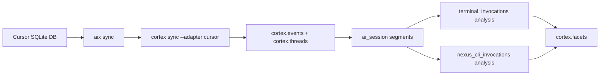

# Cursor Tool Invocation Pipeline (AIX → Cortex)

This document describes how we ingest Cursor session logs, extract terminal
invocations, and produce ordered facets for analysis. It also captures the
Cursor-specific idiosyncrasies we learned and how we used the pipeline in
cortex to backfill nexus CLI usage.

## Why This Exists

We want durable, ordered usage data across AI sessions so we can:
- backfill command usage without modifying the CLI
- analyze workflows across sessions and threads
- build next-action suggestions from real sequences
- separate direct CLI usage from wrappers (cargo, pnpm, etc.)

This pipeline is intentionally fast and local: it uses regex + parsing rather
than LLM extraction.

## End-to-End Flow



## Cursor Idiosyncrasies (Current)

These are source-specific behaviors we now handle explicitly:

- Terminal tool calls are logged as **two names**:
  - `run_terminal_cmd` (older)
  - `run_terminal_command_v2` (current)
- Terminal command payloads are stored inside `toolFormerData`:
  - `params.command` is the raw command string
  - `rawArgs` may also contain the command string
- Commands often include **env assignments** at the front:
  - `NEXUS_HOME=... NEXUS_PASSWORD=... cargo run -p cli -- ...`
  - We strip those before determining the binary
- Direct `nexus-cloud` usage is rare during development; most real usage is:
  - `cargo run -p cli -- ...` (normalized to `nexus-cloud`)

We keep these idiosyncrasies in the source adapter logic (`aix`) and the
terminal parser (`compute/nexus_cli.go`).

## Data Model Summary

### Events

Terminal commands are stored as events:
- `events.source_adapter = cursor_tool`
- `events.content = <raw command>`
- `events.thread_id = aix_session:<session_id>`

### Segments

We chunk sessions into ordered segments:
- `ai_session` definition
- one segment per session thread
- ordering preserved via `segment_events.position`

### Invocation JSON (Structured Output)

Terminal and nexus CLI analysis emit JSON per invocation:
```json
{
  "event_id": "cursor_tool:<message_id>:<tool_call_id>",
  "position": 123,
  "timestamp": 1700000000,
  "command": "nexus-cloud --help",
  "raw_command": "NEXUS_HOME=... nexus-cloud --help",
  "binary": "nexus-cloud",
  "subcommand": "--help",
  "args": "",
  "segment_index": 0,
  "invocation_kind": "direct"
}
```

`invocation_kind` allows us to distinguish:
- `direct`: binary invoked directly
- `wrapper:<wrapper>`: launched by `pnpm`, `npx`, `npm exec`, `yarn dlx`
- `cargo_run`: launched via `cargo run -p cli -- ...`

## What We Used It For (Cortex)

We used this pipeline to backfill nexus CLI usage from Cursor logs:
- direct `nexus` / `nexus-cloud` invocations
- `cargo run -p cli -- ...` alias normalized to `nexus-cloud`

This is stored as facets:
- `nexus_invocation` (JSON string)
- `nexus_command`
- `nexus_subcommand`
- `nexus_binary`

We also added a generic extractor for all terminal commands:
- `terminal_invocation`
- `terminal_command`
- `terminal_subcommand`
- `terminal_binary`

## Recommended Commands (Local)

```bash
# 1) Sync Cursor sessions into AIX
aix sync --source cursor

# 2) Import into cortex
cortex sync --adapter cursor

# 3) Build AI session segments
cortex chunk seed
cortex chunk run --definition ai_session

# 4) Seed analysis types
cortex compute seed

# 5) Extract terminal usage (generic)
cortex extract terminal --channel cursor --definition ai_session --since 15d
cortex compute run

# 6) Extract nexus CLI usage (normalized)
cortex extract nexus-cli --channel cursor --definition ai_session --since 15d
cortex compute run
```

## Future Extensions

- **Skill invocations inside nexus**:
  - Track internally in nexus/nexus-cloud and emit structured events.
  - This pipeline remains a reliable backfill layer when internal
    instrumentation isn’t available.
- **Source-specific normalization**:
  - Codex, Claude Desktop, OpenCode will each require their own mappings.
  - Keep those rules scoped by source adapter to avoid cross-contamination.
